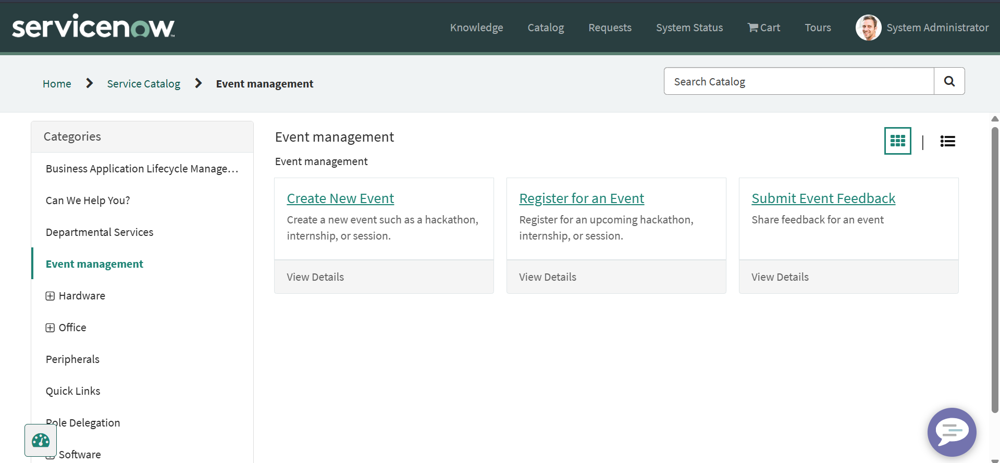
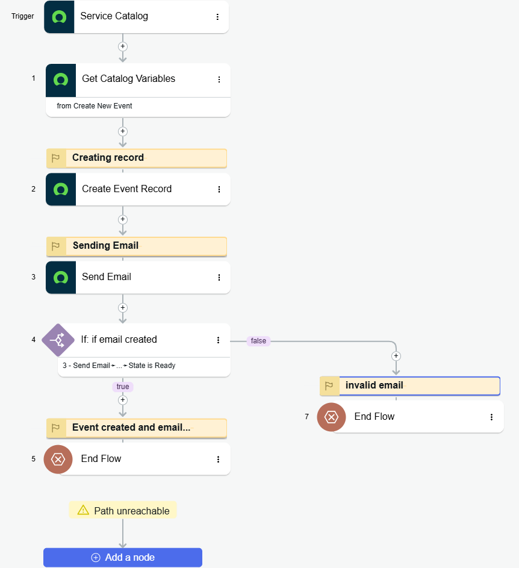
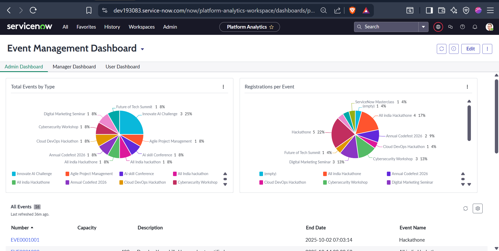
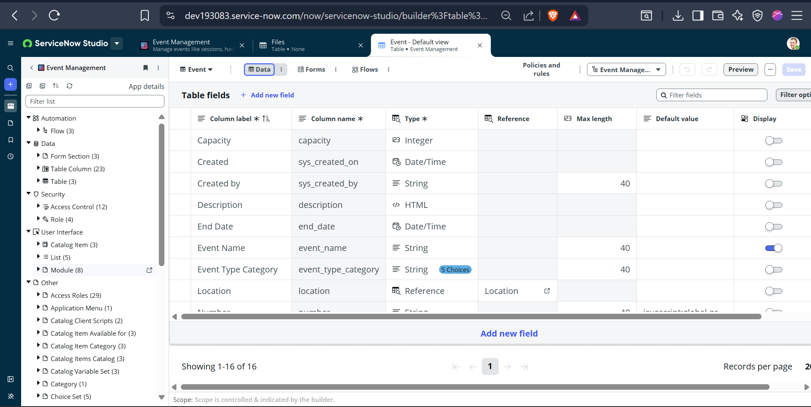

A custom Event Registration application built on ServiceNow App Engine Studio and Flow Designer with automated approvals and notifications.
# 🎫 ServiceNow Event Registration Application

A custom **Event Registration Application** built on **ServiceNow App Engine Studio** and **Flow Designer**.  
This app automates the process of event creation, attendee registration, approvals, and feedback collection — all within the ServiceNow platform.

---
> 📍 Developer: [Eswar Ram Kumar Kanchi](https://www.linkedin.com/in/eswar-ram-kumar-kanchi)

---
## 🚀 Overview

The **Event Registration App** allows users to register for events and sessions directly from the Service Catalog.  
Approvals and notifications are automated using Flow Designer.  
Admins can manage events, monitor registrations, and analyze feedback through reports and dashboards.

---

### 🎯 Key Objectives
- Automate event registration & feedback workflows  
- Enable role-based dashboard access  
- Improve event analysis with live metrics  
- Demonstrate practical ServiceNow development skills (CAD/CSA level)

---
## ⚙️ Key Features

- 📝 **Catalog Item:** Enables users to register for events and sessions  
- 🔄 **Flow Designer:** Automates approvals and email notifications  
- 📬 **Notifications:** Confirmation emails for both users and admins  
- 🔐 **Role-Based Access:** Roles for `event_user` and `event_admin`  
- 📊 **Dashboard:** Displays active events, total registrations, and feedback insights  
- 💬 **Feedback Module:** Allows users to submit feedback after events  

---

## 🧩 Data Model

| Table Name | System Name | Description |
|-------------|--------------|-------------|
| **Event** | `x_1798866_event_ma_event` | Stores event details such as name, date, location, and description |
| **Registration** | `x_1798866_event_ma_registration` | Captures attendee registration details including event, session, and status |
| **Feedback** | `x_1798866_event_ma_feedback` | Stores user feedback and ratings for post-event evaluation |

---

## 🧩 Application Components

| Component | Description |
|------------|--------------|
| **Event Table** | Stores event information such as name, session, and details (`x_1798866_event_ma_event`) |
| **Registration Table** | Captures user registration data and approval status (`x_1798866_event_ma_registration`) |
| **Feedback Table** | Stores event feedback from participants (`x_1798866_event_ma_feedback`) |
| **Catalog Items** | Event Registration and Event Feedback |
| **Flow Designer** | Automates approvals and email notifications |
| **Notifications** | Sends confirmation and updates to users/admins |
| **Dashboard** | Displays real-time event statistics and feedback insights |

---

## 🧠 Roles & Permissions

| Role | Description |
|------|--------------|
| `event_admin` | Create/manage events, view feedback & dashboards |
| `event_user` | Register for events, submit feedback |

---
---

## 🧾 Demo Video

🎥 Watch the full live demo of this application here:  
https://drive.google.com/file/d/1OwbuvaB684DdwbyblkmvzfYEbcm7a9Tc/view?usp=drive_link
---

## 🧰 Installation Guide

To import and test this app in your own ServiceNow instance:

1. Download the update set XML file from the `/update_set` folder.  
2. In your instance, navigate to:  
   **System Update Sets → Retrieved Update Sets → Import Update Set from XML**  
3. Preview and Commit the update set.  
4. Assign roles (`event_user`, `event_admin`) to your test users.  
5. Access the Catalog Item under the Service Catalog to test event registration flow.


---

## 📸 Screenshots

| Section | Screenshot |
|----------|-------------|
| Catalog Items |  |
| Flow Designer Flow |  |
| Dashboard |  |
| Feedback Table |  |


## 📊 Application Workflow

```text
[User Submits Event Registration Catalog Item]
        ↓
[Flow Designer Trigger]
        ↓
[Approval Request → Admin]
        ↓
[Email Notifications Sent]
        ↓
[Dashboard Updated Automatically]
